# 计算机网络系统概述

##  计算机网络性能指标

速率: 连接在计算机网络上的主题在数字信道中传送比特的速率，也成比特率或数据率

常用的速率单位

bit/s  比特每秒
kb/s = 1000bit/s
Mb/s = 10^6bit/s
Gb/s = 10^9bit/s
Tb/s = 10^12bit/s

常用的数据量单位

8 bit = 1 Byte
KB = 2^10B
MB = 2^20B
GB = 2^30B
TB = 2^40B

> 注意数据量单位是字节，而速率是比特，字节 * 8转化为比特即可进行计算,例如100MB / 100Mb/s = 100MB * 8 / 100Mb/s = 8s(大约)

带宽: 单位时间内从网络中的某一点到另一点能通过的最高数据率

单位: b/s kb/s Mb/s Gb/s Tb/s

常规情况下，个人电脑家庭用网的最高带宽就是1000Mb/s ,这是一个最高的数据率，而实际的速率却根据实际情况而不同，所以说，你虽然说是千兆的带宽，但不一定可以得到千兆的速率(意指最高)

带宽要使用对等的设备才可以发挥最大的优势，例如网卡的带宽，网线的带宽，路由器的带宽要同样使用千兆才可以达到最高的数率

## 物理层  

### 传输媒体 - 双绞线 & 光纤 & 无线电
我们把电线中的0v和5v当做是两种不同的状态,0v代表数字0,5v代表1。我们就可以用电线来传递数字了

但是我们如何传递文字呢？英文？中文？

我们就可以使用编码，ASCII 来用数字表示字符


网络的传递介质有很多，除了网线（电缆）之外，我们还可能有光纤（光缆）、无线电（wifi）

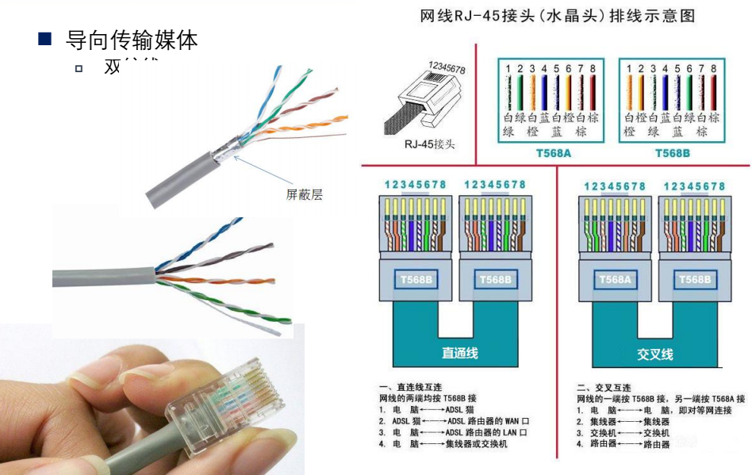

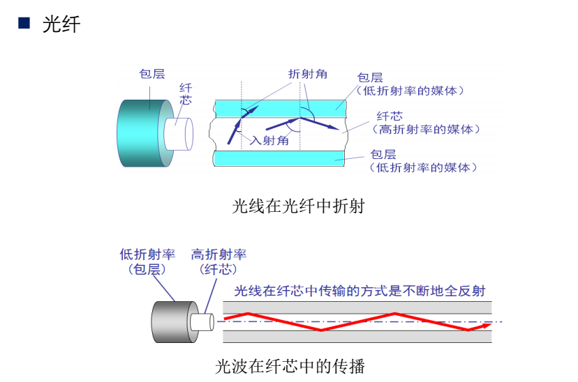

光纤的开和关可以表示0和1

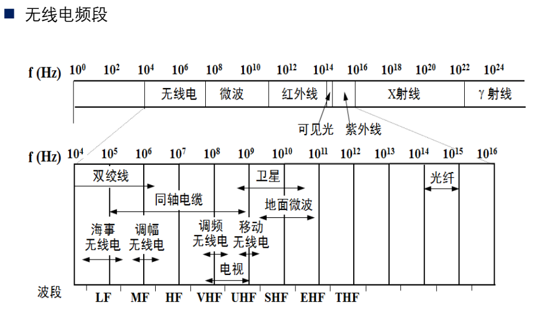

简单的说你可以理解为无线电在周围会产生一个磁场，会不断的向外界发送一个不断变化的电场（不断改变电压值）

我们的手机或者其他可以上网的设备可以接收它，当然我目前还没弄明白它是怎么做的?

我们可以把其中一种波形表示为0,另外一种波形表示为1

### 数字信号编码调制 -- 曼彻斯特编码 

编码的作用其实还是为了将数字基带信号转化为带有时钟特性的信号，以便更好的区分数据中的0和1

调制的作用其实就是为了将数字基带信号转化为模拟信号，目前电话线作为上网设备的时候是使用调制解调器来进行数字信号到模拟信号的转化，那么，大部分情况下，网卡、网线、路由器、交换器这些都是数字信号

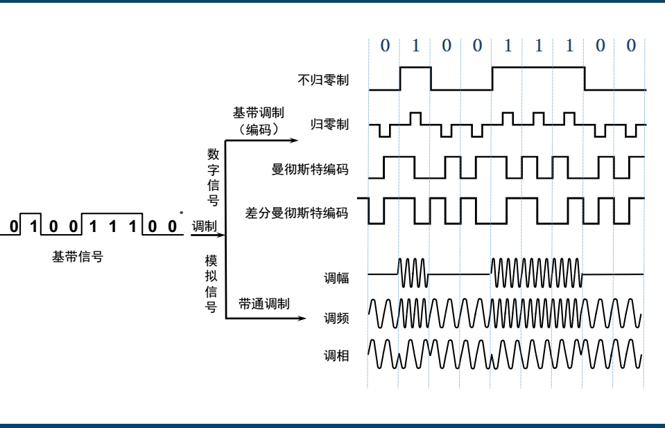

- 不归零：高电平代表1，低电平代表0
- 归零：0的话向下跳，跳完归0，1的话向上跳，跳完归0
- 曼彻斯特：0的话从低电平跳向高电平，1的话从高电平跳向低电平
- 差分曼彻斯特：根据前一个电平的高低，0的话跳变，1的话不跳变。
- 调幅：0的话没有幅度，1的话幅度会大
- 调频：0的话频率小，1的话频率大
- 调相：波形不一样

> 注意一下它的时间间隔


### 实际网络中的0和1是如何传递的

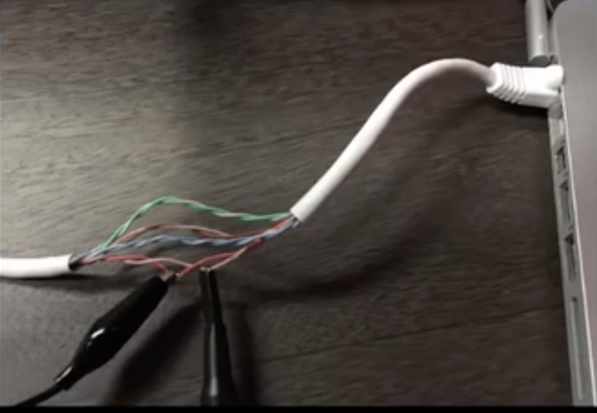

我们先了解下数据传输的一些相关单位

10M/bps:代表的含义是每秒传送10M的数据量(一千万个0和1)

100M/bps:每秒传送100M的数据量

1G/bps:每秒传送1G的数据量(0和1)

20G/bps:每秒传送20G的数据量(0和1)

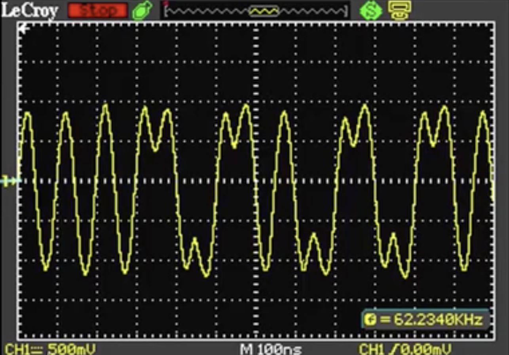

x轴为时间间隔,这里的单位是100纳秒

y轴为电压,500mv一格，所以电压是在1v和-1v之间来回

图中代表着每一个0和1传递的波形(在100M/bps下)

看它的话就是看在100ns的结束点是从低电压 ---> 高电压 还是 高电压 ----> 低电压

> 我们需要注意的是计算机网络的传递数据是从后面往前传递的，注意我们的网络字节序是不一样的

##  数据链路层

### 真实的帧格式

数据像流水一样不断的传递 0 和 1 ,虽然可以得到数据，但是我们怎么才能分辨哪些数据是整体

我们需要确定数据的边界

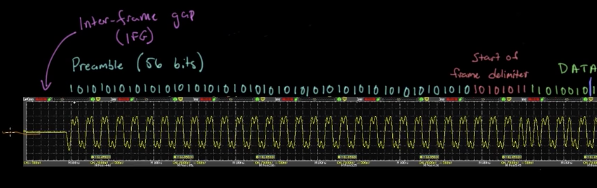

以太网帧刚开始的时候会经历一个96bit传输的静默期(保持0电压),表示我还没有开始

然后传递56个0和1交替组成，是以太网帧的7字节同步码

然后是以太网开始帧的定界符 10101011 (一字节)

接下来就可以读取数据了，每8位读取一字节的数据

最后还有个帧的校验（记录帧的大小，防止帧大小变化）

## 帧字段

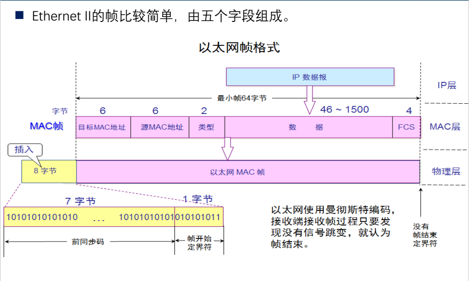

一旦帧开始传输数据，它包括了 6字节的源mac地址,6字节的目标mac地址，2字节的类型,46-1500字节大小的数据

以太网帧 = 6字节源mac地址  +  6字节的目标mac地址  + 2 字节的类型 + 46-1500字节的数据 + 4字节的校验

> 同步码和定界符是链路层设备加上的（网卡、交换机、路由器）


### 数据链路层 - 交换机

交换机直接和计算机相连，A计算机接到交换机的E0口，B接到交换机的E1口，A和B通信的时候，从E0口直接给E1口，数据只会从A计算机传递到B计算机

交换机的工作原理:交换机属于二层设备,可以识别以太网帧中的MAC地址信息,根据MAC地址转发,并把MAC地址与对应的端口记录在自己内部的地址表中

- 当交换机从某个端口收到一个数据包，它先读取包头中的源MAC地址，这样它就知道源MAC地址的机器是连在哪个端口上的
- 再去读取包头中的目的MAC地址，并在地址表中查找相应的端口
- 如表中有与这目的MAC地址对应的端口，把数据包直接发送到这端口上
- 如表中找不到相应的端口则把数据包广播到所有端口上(这个叫洪泛,盲目转发)，当目的机器对源机器回应时，交换机又可以学习一目的MAC地址与哪个端口对应，在下次传送数据时就不再需要对所有端口进行广播了
- 不断的循环这个过程，对于全网的MAC地址信息都可以学习到，二层交换机就是这样建立和维护它自己的地址表

> 交换机记录信息  = MAC地址 与 端口的映射


## 4. 网络层

加入IP协议的主要目的我觉得简单的说，或者是通俗点来说的话，就是我们需要路由器将不同的局域网连接起来，所以我们需要一个IP地址

当我们带着自己的IP地址 + 目标IP地址 + 源MAC地址 + 未知的目标MAC地址的时候,我们首先判断目标IP地址和自己的IP地址是否在同一个网段，这里分了两种情况

1. 同一个网段

- 首先检查自己的ARP缓存表,有没有缓存目标B的IP地址对应的MAC地址,如果有,发送给交换机,由交换机完成端口转发(交换机记录B对应的端口)
- A先发送ARP协议,询问所有的网络中的主机，谁的IP地址是目标B主机IP地址(目标MAC ff::ff::ff交换机转发,交换机记录A MAC-1端口)，所有主机收到ARP
- 目标B的主机回应ARP响应，告诉A我是目标IP地址，并给到自己的MAC地址,通过交换机回复A主机(交换机记录B MAC-2端口),并将A的MAC地址存入自己的ARP缓存表中(B记录A IP-MAC)
- 这一次，A的ARP缓存表缓存了B主机的MAC地址,(A记录B IP-MAC )然后再次发送数据,这次就可以直接交付给B主机了..见步骤1

2. 不同的网段

- 首先检查自己的ARP缓存表,有没有缓存路由器的MAC地址,如果有,发送给交换机,由交换机完成端口转发(交换机记录路由器对应端口)
- 我们事先已经在电脑中设置了我们的网关 -- 也就是我们的路由器的IP地址
- A先发送ARP协议，询问所有的网络中的主机，谁的IP地址是网关(目标MAC ff::ff::ff交换机转发,交换机记录A MAC-1端口) ARP协议中目标IP地址是网关
- 路由器收到后,记录A的IP地址对应的MAC地址到自己的ARP高速缓存表中(路由器记录A IP-MAC)
- 路由器响应ARP,告诉A，我是目标IP地址，并给到自己端口的MAC地址,通过交换机发给A(交换机记录 路由器 MAC-2端口) 
- 到达A后A的ARP缓存表缓存了路由器的MAC地址(A记录路由器 IP-MAC),然后再发送数据,这次可以直接发送给路由器了..见步骤1

> 电脑、路由器 ARP缓存表  = IP地址 MAC地址映射

路由表的作用实际是记录到达目标IP地址，下一跳是哪个端口或者是哪个IP地址


### 划分子网

假设192.168.0.0这个网段,它支持255个主机,我们如果想添加一个新的网段192.168.1.0,它又可以支持255个主机,但是我们真的有那么多的主机吗？我们其实需要的是更多的网段

于是，我们把主机部分的某些比特位拿出来作为网络,顺便用子网掩码来表示哪些是网络，哪些是主机

我们有两种方案:一种是平均分，还有一种是按需分,平均分就是定长子网,按需分就是变长子网

192.168.0.1 ---- 192.168.0.254 可以分成任意你想要的整数倍的子网,先分好之后再算具体范围是哪些就行了

100台左右 -- 255.255.255.128,原来的一半作为一个子网(0.1 - 0.127),网段是192.168.0.0

50台左右 -- 255.255.255.192,原来的四分之一为一个子网(0.129 - 0.191),网段是192.168.0.128

20台左右 -- 255.255.255.224,原来的八分之一(0.193 - 0.225),网段是 192.168.0.192

至于先分100还是先分20,这个就无所谓了

### 网络层 - 路由器

路由器拿到之后，会根据路由表不断的变化MAC地址将数据传递出去

- 路由器通电后，会记录每个网段对应的端口
- 数据包从路由器的某一个端口进来,路由器解包根据目标IP地址的网段查看该路由器的路由表,判断应该从哪个端口进行转发或者下一跳的IP地址,找不到的话就直接丢弃了或者走默认路由....

第一种情况:路由器--交换机（通常考虑是直连的网段，目标IP跟路由器直接相连）

- 路由器每个端口对应着不同的网段,路由器开机的时候会自动记录每个端口对应的网段(因为是直连)
- 数据包达到路由器端口后,因为目标IP与路由器的某个端口直接相连,路由表中记录(目标网络 下一跳 接口),所以,路由器直接将该数据包转发到对应网段的端口上
- 路由器查找ARP缓存表，看下有没有目标IP地址的MAC地址，有直接交换机转发，不在进行下一步
- 目标IP的MAC地址没有在ARP缓存表中的话,丢弃该帧
- 路由器发ARP请求,通过交换机(ff::ff::ff广播)广播给所有的主机(交换机记录 路由器MAC-1端口)
- 目标IP地址的主机B收到后,首先缓存路由器IP地址和MAC地址(B记录路由器 IP-MAC)，然后通过交换机(交换机记录 B-2端口)转发给路由器
- 路由器缓存了目标IP地址的MAC地址(路由器记录B IP-MAC)
- 下次数据再来的时候,从步骤三直接发送给目标主机B

第二种情况:路由器--路由器 (通常考虑是非直连的网段,目标IP跟路由器并不直接相连)

- 数据包到达路由器端口后,因为目标IP的网段与路由器直连的网段都不相同,所以路由器根据路由表决定下一跳
- 根据路由表信息,路由器将对应的数据包转发到对应的端口上
- 数据包达到路由器端口后，路由器检查自己的ARP缓存表,看下有没有下一跳的MAC地址,有的话直接发送出去
- 如果找不到目标IP地址对应的MAC地址直接丢弃该帧
- 路由器发送ARP请求,得到下一跳的IP地址(路由器)的MAC地址,并缓存起来 (路由器1记录 路由器2 IP-MAC)
- 下次数据再来的时候,从步骤三直接发送给下一个路由

> 如果只过一个路由器,丢包一次,过两个路由器的话,丢包两次


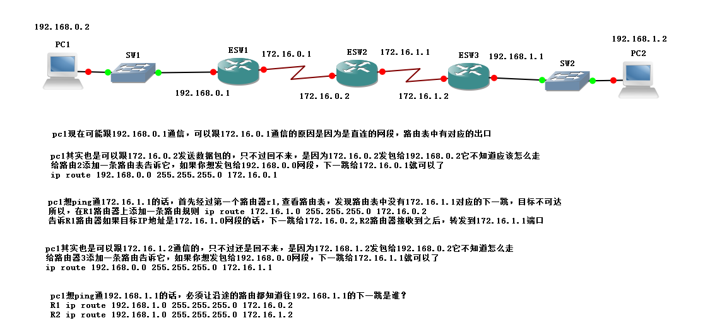

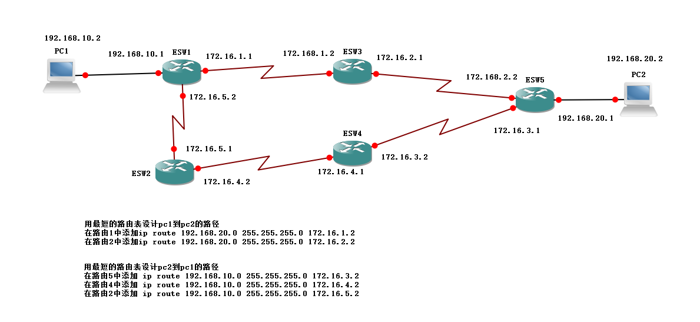

IP层和数据链路层是为了寻路,找到正确的路径才能正确的达到目的地.....

ARP是为了得到目的地的MAC地址，而我们判断的依据就是IP地址(目标IP地址的MAC地址是什么)


###  IP分片

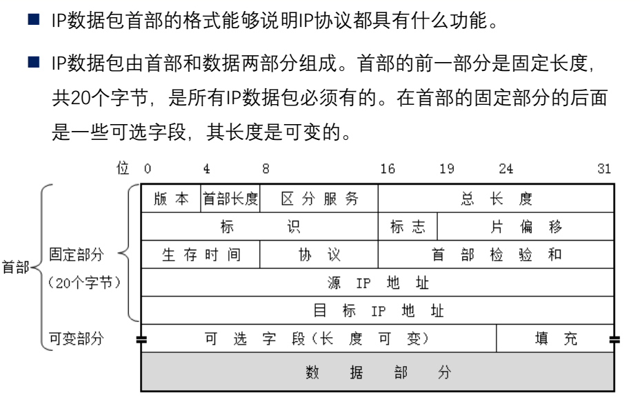

- 版本(4字节) 指的是IP协议的版本 IPV4 / IPV6
- 首部长度(4位) 十进制的首部长度 * 4 = 首部的长度,最大是15 * 4 = 60, 但通常为20个字节
- 区分服务(8位) 感觉就是优先服务的意思,前提是路由器支持
- 总长度(16位) IP数据包的长度,最大的IP数据包的大小是65535个字节,实际应该没有这么大
- 标识(16位) 分片的时候,一个数据包又相同的标识
- 标志(3位) 忽略
- 片偏移(13位) 8字节(64位)的整数倍, 假设数据从1400个字节开始分片,那么对应的片的偏移量就是1400/8 = 175
- 生存时间(8位) 跳数
- 协议(8位) 指出数据包携带的数据是使用何种协议
- 首部校验和(16位)

一般情况下,UDP会考虑分片的问题,TCP会通过MSS选项来避免IP分片,在建立TCP连接的时候,TCP协议会进行路径MTU探测,确定整个路径上的最小MTU,在三次握手的时候,双方会协商一个最大段大小(MSS 1500 - 20 - 20),以确保TCP报文不会超过路径MTU

常规的MTU的大小是1500个字节，一旦UDP发送的数据超过1500个字节的话,IP会负责将包进行分片,以避免帧过大网卡发不出去

假设UDP发送了一个总长度为2000字节的数据包

第一个分片的大小是IP头部20字节 + 数据部分1480

第二个分片的大小是IP头部20字节 + 数据部分520，片偏移为1480

那么,其实UDP的发送数据的大小，发送规律都由应用层控制，假设涉及到丢包或者重传的，也是由应用层来控制


### ICMP协议

ping命令就是个ICMP协议的IP包,它的ICMP信息放在IP包的数据部分

- ICMP报文类型(1个字节)
- 报文代码(1个字节)
- 校验和(2个字节)
- 数据部分(通常就是一些简单的数据0-9A-Z)

ICMP请求报文

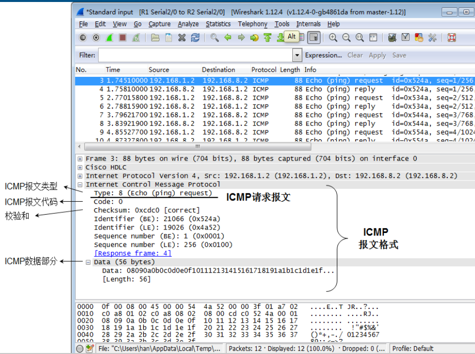

ICMP响应报文

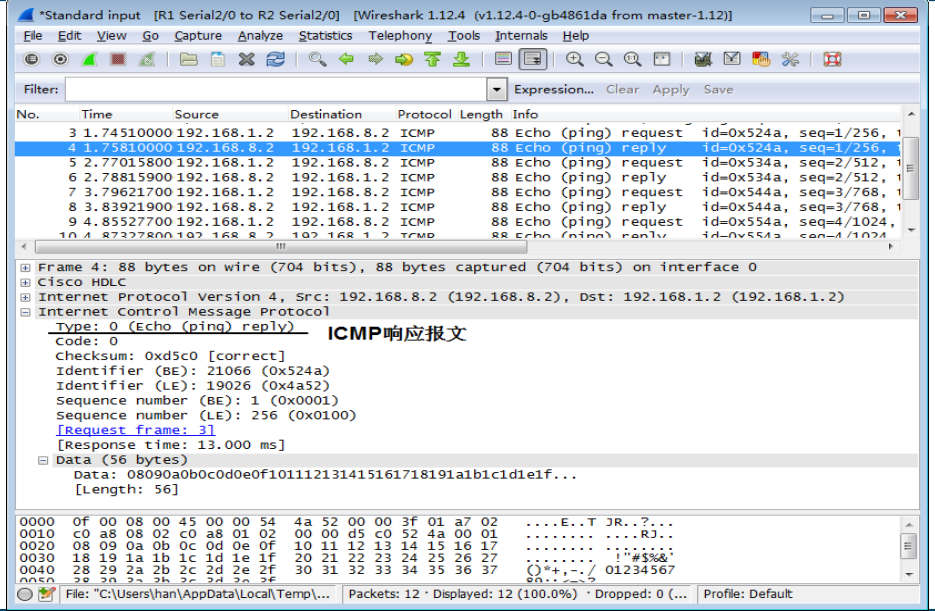

这里一定注意，如果是个差错报告的IP数据包，那么它的数据部分就全部是差错报告报文，并且里面包含了IP数据包的首部(产生错误的那个数据包的首部).

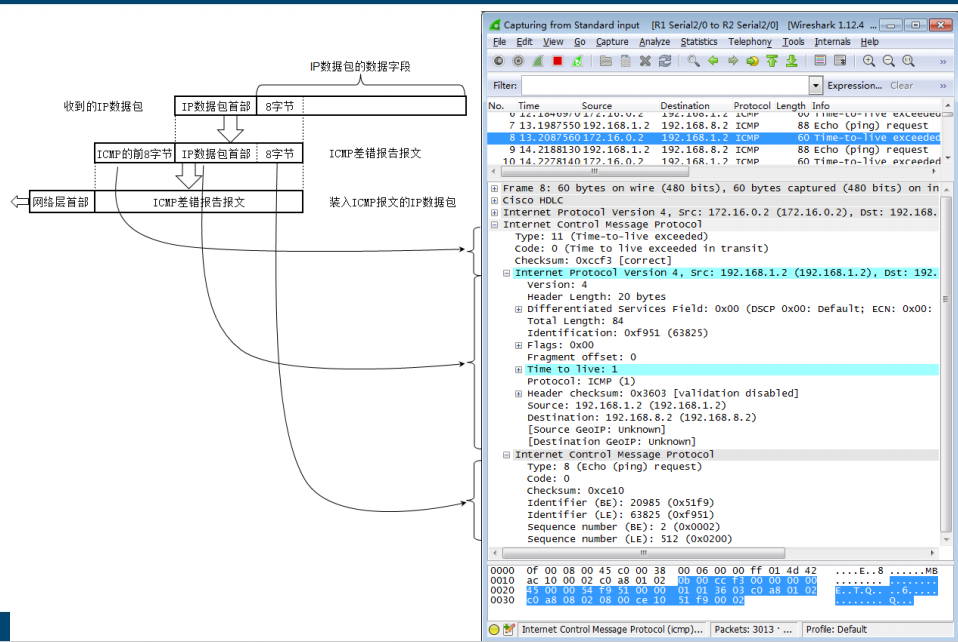


### ARP协议

ARP协议的作用就是将以太网中的计算机的IP地址解析成MAC地址

## 5. 传输层 TCP

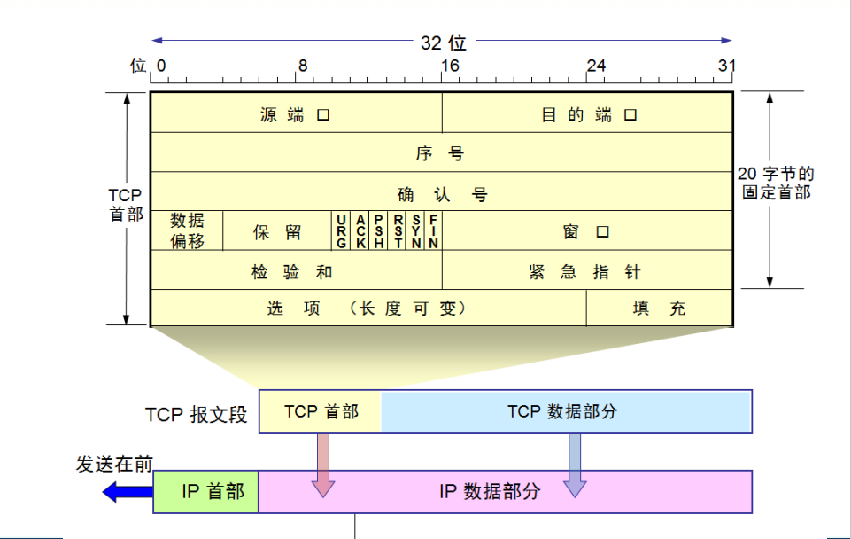
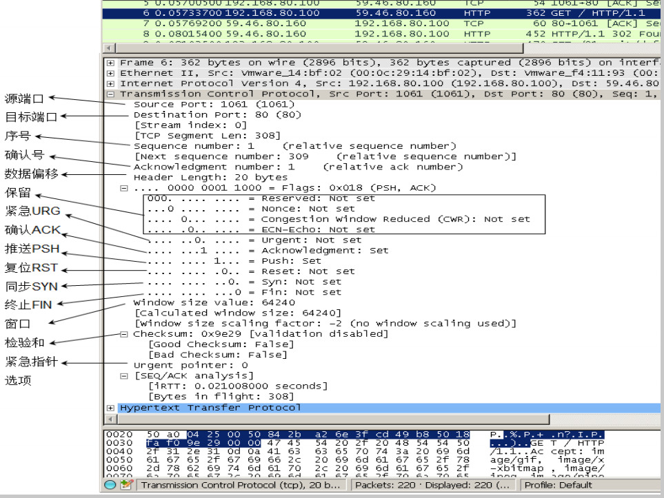

我们可以在此时，将我们在网络层/数据链路层的知识做一些梳理:

当我们建立TCP连接的时候,我们会进行三次握手,三次握手的过程实际就完成了寻路的功能,你可以假设一旦网络有问题,实际我们的三次握手是不会成功的,一旦我们的三次握手结束,就意味着连接双方是互通的状态了

1. 同一网段

```
A -------- ARP ------> 查询IP对应的Mac地址
A <-------- ARP <------ B告诉A我的mac地址
A -----------> SYN --------> B
A <----------  SYN+ACK <----- B
A ----------> ACK -----------> B
```

2. 不同网段

```
A ----> ARP ---> 交换机 ----> 默认路由(出口网关) 查询网关的MAC地址信息,封装后发给默认路由
A <---- ARP <---- 交换机 <---- 默认路由 返回自己的MAC地址
A ----> SYN ----> 交换机 ----> 默认路由 ---> 下一跳 ----> B
A <---- SYN+ACK <----- 交换机 <----- 默认路由 <---- 下一跳 <----- B
A -----> ACK ------> 交换机 -----> 默认路由 ---> 下一跳 ----> B  

这里注意一个细节的问题,当ARP协议发送完毕并返回的时候, A --> 默认路由的链路是互通的,唯一有可能失败的地方在于路由表在跳的时候,可能因为并没有缓存下一跳的MAC地址(目标主机或者是下一个路由器)导致失败,因此无论下一跳是目标主机还是路由器,那么该路由器都需要重新发送ARP协议获取MAC地址,这可能会导致的问题是当数据包一开始发送的时候,会发包失败

这时候,TCP会尝试重新发送数据包,"超时重传"来处理丢失的数据包,当发送方没有收到数据包的确认的时候,它会在一定的超时时间后重新发送该数据包

A ----> SYN ----> 交换机 ----> 默认路由 ---> 下一跳(失败) ----> B
// 重传(一般是3到5次)
A ----> SYN ----> 交换机 ----> 默认路由 ---> 下一跳 ----> B
// 一旦路由器之间的ARP缓存成功后,后面的数据传输就不用考虑互通的问题

所以有可能你会在抓包软件中看到,syn发送之后,紧接着arp协议,并未发现有失败或者重传的两个syn包,是因为抓包软件中只会显示成功发送的syn包,而不会显示重传的syn包
```

### 可靠传输:超时重传机制 -- 解决TCP 丢包/乱序

TCP使用相同的超时重传机制来处理初次建立连接的握手过程和数据交换阶段的数据包丢失情况

- 超时未收到确认(ACK,数据交换阶段)
- 接收方收到了重复的数据包(乱序情况)
- 网络发生丢包(握手阶段)

### 可靠传输:拥塞控制 -- TCP 发送方发送大量数据的处理方法

```
// send大量的数据
char szSendBuf[1024 * 64 * 10] = {0};
int iRet = send(sockClient, szSendBuf, sizeof(szSendBuf) , 0);

// 实际是没有任何问题的,TCP内核会将这些大量的数据拆分成多个包同时发送出去
// 但是读的时候就要while循环的将这些数据批量接收
while(1)
	{
	    char szRecvBuf[1024 * 64] = {0};
	    int iRet = recv(sockConn, szRecvBuf, sizeof(szRecvBuf), 0);
		total += iRet;
	    printf("iRet is %u, total %u\n", iRet, total);
		getchar();
	}
// 发送的时候发送一次就可以了
// 接收的时候需要多次的接收
// 底层的TCP内核程序会将这些数据拆成包发送....
// TCP因为会拆包所以，数据的边界是不清晰的，需要应用层的协议去定义如何去拆包
```

### 可靠传输:拥塞控制 --- TCP 发送方发送过小数据的处理方法

TCP 使用以下条件来决定何时在收到的数据包上发送 ACK

1. 如果在延迟(200ms)计时器过期之前收到了第二个数据包,则发送 ACK
2. 如果在收到第二个数据包且延迟计时器过期之前,有于 ACK 相同方向发送的数据,则会将该 ACK 与数据段合并立即发送
3. 当延迟计时器过期的时候,发送 ACK

可以看到,无论任何时候,ACK 的包都需要及时的发送,发送是为了保证 TCP 的包的可靠性,需要接收方不断的确认接收到的数据...

在此基础上,为了避免不断的发送 ACK,启动了延迟 ACK

**所以,当客户端发来数据的时候,服务器并没有立即 ACK,而是等待了一段时间,等待的这段时间就是看服务器是否也会发送数据给客户端,将 ACK 携带着给客户端提高利用率**

**所以如果数据是单向的客户端不断的给服务器发送数据,你看到的就是在第二包发送成功之前就收到了来自服务器的 ACK,所以你看到的就是 a--延迟---ACK--b--延迟--ACK-c--延迟--ACK....**

这里注意一点,b 包发送的时间是 延迟的时间 + 收到 a 的 ACK 的时间,你可以理解为这是加了Nagle算法的结果,不可能出现两个以上的需要ACK的包,想象一下,如果去掉Nagle算法的话,实际是存在那种a ---- b --- 延迟 --- ACK的情况的

1. 要等到窗口大小 >= MSS 或是 数据大小 >= MSS
2. 收到之前发送数据的 ack 回包

这个默认是开启的状态,TCP_NODELAY 为开启状态,所以,在

可以选择将它关闭,关闭的情况主要考虑到是对实时性要求比较高的场景,类似用户的鼠标操作/键盘输入/状态更新这种连续的小分组数据,需要立刻在对端立即呈现.

### 可靠传输:拥塞控制 --- TCP 发送方发送数据过快的处理方法(客户端发送的总是很快,但服务器接收的速度总是很慢)

对比文件,写入磁盘的速度远比读取数据慢的多了,所以,一切都是为了避免写入的数据过快来不及处理

NodeJS 中为了不积压,pipe 当可写流返回 false 的时候,可读流停止..可写流 drain 的时候再恢复可读流;另外 hightWaterMark 也定义了可读流从底层读取数据的大小,精准的控制这个大小可避免可读流读的太快...

在 TCP 中, 增加了窗口的概念,接收方将自己的`窗口大小`发送给发送方,发送方根据接收方的窗口大小决定发送的速度

我的理解并不是在一个 ACK 之前,可发送的最大的数据包,而是在未达到窗口大小前,发送放可一直处于不断发送阶段,发送过程不能停....当达到窗口大小为 0 的时候,发送过程终止....

终止的过程: 客户端会告知服务器,自己的接收窗口为0,这时候TCP服务器会keep-alive不断等待客户端窗口变化,直到窗口不为0继续进行发送

自动调整自身窗口大小就是 TCP`流量控制`

### 可靠传输: 拥塞控制 --- TCP 发送方发送数据延时/网络情况不好

流量控制是受接收能力影响的.但拥塞问题是受网络环境影响的.这就是为了解决数据延迟的`拥塞避免`.同样都是通过调整窗口大小来避免拥塞..

当接收方的接收能力比较差的时候,即使网络非常通畅,发送方也要根据接收方的能力限制自己的发送窗口.


拥塞窗口可以看做是发送方自身控制的窗口,用于控制发送数据的速率,而流量控制的滑动窗口则是接收方控制的窗口,用于告知发送方可以发送的数据,以适应接收方的处理能力和网络状况

所以,实际的窗口大小 = min(cwnd(拥塞窗口-自己的窗口),rwnd(流量控制的滑动窗口-对方的窗口))


## 6. 应用层HTTP


我们在传输数据时，可以只使用（传输层）TCP/IP协议，但是那样的话，如果没有应用层，便无法识别数据内容，如果想要使传输的数据有意义，则必须使用到应用层协议，应用层协议有很多，比如HTTP、FTP、TELNET等，也可以自己定义应用层协议。WEB使用HTTP协议作应用层协议，以封装HTTP文本信息，然后使用TCP/IP做传输层协议将它发到网络上

------------------------------------------------------------------------------------------------------------------------------

服务器调用socket()打开一个网络通信的端口，成功的话会像open一样返回一个文件描述符，应用程序可以像读写文件一样用read/write在网络上发送数据

服务器调用bind()将socketfd和一个端口绑定

服务器调用listen()监听端口上的请求

服务器调用accept()等待客户端的请求,此时服务器处于阻塞的等待状态

客户端调用connect()发送连接请求

客户端 ------------SYN + 序号x--------------->  服务器


客户端等待中..... SYN_SENT状态

客户端 <-----------ACK + SYN + 序号y + 确认号x+1---------------- 服务器

服务器等待中... SYN_RCVD状态

客户端从connect()返回一个成功信息

客户端 -------------ACK + 序号x+1 + 确认号y+1 --------------> 服务器

客户端完成了自己的任务..... ESTABLISHED状态

服务器也完成了自己的任务.... ESTABLISHED状态

服务器的accept()返回一个客户端的socket实例,client_socket

------------------------------------------------------------------------------------------------------------------------------

> 三次握手的目的是为了沟通序号和确认号并且防止两次握手的时候，出现丢失或者延迟

数据传输开始........

客户端封装 http请求头 + 请求体

        GET  index.html  / HTTP/1.1
        Host:"www.baidu.com"
        User-Agent:"Mozilla/5.0 (Windows NT 10.0; WOW64; rv:52.0) Gecko/20100101 Firefox/52.0"
        Connection: Keep-Alive

        POST  index.html  / HTTP/1.1
        Host:"www.baidu.com"
        User-Agent:"Mozilla/5.0 (Windows NT 10.0; WOW64; rv:52.0) Gecko/20100101 Firefox/52.0"
        Connection: Keep-Alive
        Pn=2&kw=nba

客户端请求 ---------------------------> 服务器

服务器接收到HTTP的字符之后,


客户端 <------------------------------ 服务器响应


------------------------------------------------------------------------------------------------------------------------------

由客户端主动发起断开连接的请求....

客户端 ------------FIN + ACK--------------->  服务器

客户端等待中.....处于FIN_WAIT_1状态

客户端 <-----------ACK---------------- 服务器

客户端等待中...处于FIN_WAIT_2状态,只能接收数据....(半连接)

服务器处于CLOSE_WAIT状态....

客户端 <-------------FIN + ACK-------------- 服务器

服务器处于LAST_ACK状态....

客户端 -------------ACK--------------> 服务器

客户端处于一个TIME_WAIT状态,防止ACK的包没有让服务器收到

服务器接收到ACK后便断开了连接close()

------------------------------------------------------------------------------------------------------------------------------


