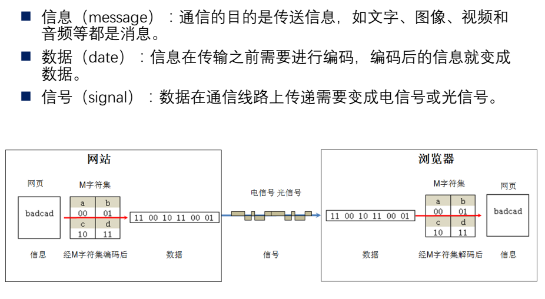

# 从一条网线到tcp/ip协议

## 1. 通过一条电线发送信息

我们把电线中的0v和5v当做是两种不同的状态,0v代表数字0,5v代表1。我们就可以用电线来传递数字了

但是我们如何传递文字呢？英文？中文？

我们就可以使用编码，ASCII 来用数字表示字符

## 2. 光纤和射频编码

网络的传递介质有很多，除了网线（电缆）之外，我们还可能有光纤（光缆）、无线电（wifi）

光纤的开和关可以表示0和1

简单的说你可以理解为无线电在周围会产生一个磁场，会不断的向外界发送一个不断变化的电场（不断改变电压值）

我们的手机或者其他可以上网的设备可以接收它，当然我目前还没弄明白它是怎么做的?

我们可以把其中一种波形表示为0,另外一种波形表示为1

## 3. 时钟同步与曼彻斯特编码

两台计算机交换数据，需要时钟同步，这个时钟可以理解为我们接收0和1的频率(时间)

发送方和接收方都必须保持在同一个时钟频率上，否则数据将会丢失

**一个时钟的脉冲就是在一个固定的时间内完成一个从0到1的一个变化过程**

发送方发送的时间要和接收方接收的时间要一致

如何才能保证时钟同步呢？

- 不归零：高电平代表1，低电平代表0
- 归零：0的话向下跳，跳完归0，1的话向上跳，跳完归0
- 曼彻斯特：0的话从低电平跳向高电平，1的话从高电平跳向低电平
- 差分曼彻斯特：根据前一个电平的高低，0的话跳变，1的话不跳变。
- 调幅：0的话没有幅度，1的话幅度会大
- 调频：0的话频率小，1的话频率大
- 调相：波形不一样

> 注意一下它的时间间隔

## 4. 实际网络中的0和1是如何传递的

我们先了解下数据传输的一些相关单位

10M/bps:代表的含义是每秒传送10M的数据量(一千万个0和1)

100M/bps:每秒传送100M的数据量

1G/bps:每秒传送1G的数据量(0和1)

20G/bps:每秒传送20G的数据量(0和1)

x轴为时间间隔,这里的单位是100纳秒

y轴为电压,500mv一格，所以电压是在1v和-1v之间来回

图中代表着每一个0和1传递的波形(在100M/bps下)

看它的话就是看在100ns的结束点是从低电压 ---> 高电压 还是 高电压 ----> 低电压

> 我们需要注意的是计算机网络的传递数据是从后面往前传递的，注意我们的网络字节序是不一样的

## 5. 0和1如何变成网络中的帧

数据像流水一样不断的传递 0 和 1 ,虽然可以得到数据，但是我们怎么才能分辨哪些数据是整体

我们需要确定数据的边界

以太网帧刚开始的时候会经历一个96bit传输的静默期(保持0电压),表示我还没有开始

然后传递56个0和1交替组成，是以太网帧的7字节同步码

然后是以太网开始帧的定界符 10101011

接下来就可以读取数据了，每8位读取一字节的数据

最后还有个帧的校验（记录帧的大小，防止帧大小变化）

## 6. 网络帧中到底包含什么东西？

一旦帧开始传输数据，它包括了 6字节的源mac地址,6字节的目标mac地址，2字节的类型,46-1500字节大小的数据

以太网帧 = 6字节源mac地址  +  6字节的目标mac地址  + 2 字节的类型 + 46-1500字节的数据 + 4字节的校验

PPP也是比较常用的帧格式，常用在大型的主干网络中,但是我们在这里就忽略不计了.....

交换机直接和计算机相连，A计算机接到交换机的E0口，B接到交换机的E1口，A和B通信的时候，从E0口直接给E1口，数据只会从A计算机传递到B计算机

交换机的工作原理:交换机属于二层设备,可以识别以太网帧中的MAC地址信息,根据MAC地址转发,并把MAC地址与对应的端口记录在自己内部的地址表中

- 当交换机从某个端口收到一个数据包，它先读取包头中的源MAC地址，这样它就知道源MAC地址的机器是连在哪个端口上的
- 再去读取包头中的目的MAC地址，并在地址表中查找相应的端口
- 如表中有与这目的MAC地址对应的端口，把数据包直接发送到这端口上
- 如表中找不到相应的端口则把数据包广播到所有端口上(这个叫洪泛,盲目转发)，当目的机器对源机器回应时，交换机又可以学习一目的MAC地址与哪个端口对应，在下次传送数据时就不再需要对所有端口进行广播了
- 不断的循环这个过程，对于全网的MAC地址信息都可以学习到，二层交换机就是这样建立和维护它自己的地址表

> 交换机一般都有跟路由器的接口，如果找不到局域网内的MAC地址，就直接转发给路由器了,由路由器来解IP包

## 7. 七层协议

其实，我更愿意看成是四层模型 

- 封包: 应用层 ------> 传输层 ------> 网络层 -------> 数据链路层

浏览器发送请求HTTP ------> 操作系统TCP/IP ---------> 网卡MAC帧 --------> 交换机/路由器 -------> 到达服务器 

- 解包: 数据链路层 -----> 网络层 -----> 传输层 ------> 应用层

服务器网卡收到MAC帧 -------> 操作系统解包TCP/IP ----------> 服务器负责处理HTTP请求

应用层来负责处理数据，传输层负责高效和安全的传递数据，控制数据传输的速度和正确性，网络层负责发送ARP来进行寻路，找到对应下一跳，确定好下一跳的MAC地址后，再经过数据链路层封装成帧在各个设备之间传递....

## 8. IP协议

加入IP协议的主要目的我觉得简单的说，或者是通俗点来说的话，就是我们需要路由器将不同的局域网连接起来，所以我们需要一个IP地址

当我们带着自己的IP地址 + 目标IP地址 + 源MAC地址 + 未知的目标MAC地址的时候,我们首先判断目标IP地址和自己的IP地址是否在同一个网段，这里分了两种情况

1. 同一个网段

- 首先检查自己的ARP缓存表,有没有缓存目标IP地址的MAC地址,如果有,直接发送,不再进行下一步;
- A先发送ARP协议,询问所有的网络中的主机，谁的IP地址是目标B主机IP地址(目标MAC ff::ff::ff交换机转发,交换机记录A MAC-1端口)，所有主机收到ARP
- 目标B的主机回应ARP响应，告诉A我是目标IP地址，并给到自己的MAC地址,通过交换机回复A主机(交换机记录B MAC-2端口),并将A的MAC地址存入自己的ARP缓存表中(B记录A IP-MAC)
- 这一次，A的ARP缓存表缓存了B主机的MAC地址,(A记录B IP-MAC )然后再次发送数据,这次就可以直接交付给B主机了..见步骤1

2. 不同的网段

- 首先检查自己的ARP缓存表,有没有缓存路由器的MAC地址,如果有,直接发送,不再进行下一步...
- 我们事先已经在电脑中设置了我们的网关 -- 也就是我们的路由器的IP地址
- A先发送ARP协议，询问所有的网络中的主机，谁的IP地址是网关(目标MAC ff::ff::ff交换机转发,交换机记录A MAC-1端口) ARP协议中目标IP地址是网关
- 路由器收到后,记录A的IP地址对应的MAC地址到自己的ARP高速缓存表中(路由器记录A IP-MAC-端口0)
- 路由器响应ARP,告诉A，我是目标IP地址，并给到自己端口的MAC地址,通过交换机发给A(交换机记录 路由器 MAC-2端口) 
- 到达A后A的ARP缓存表缓存了路由器的MAC地址(A记录路由器 IP-MAC),然后再发送数据,这次可以直接发送给路由器了..见步骤1

## 9. 划分子网

假设192.168.0.0这个网段,它支持255个主机,我们如果想添加一个新的网段192.168.1.0,它又可以支持255个主机,但是我们真的有那么多的主机吗？我们其实需要的是更多的网段

于是，我们把主机部分的某些比特位拿出来作为网络,顺便用子网掩码来表示哪些是网络，哪些是主机

我们有两种方案:一种是平均分，还有一种是按需分,平均分就是定长子网,按需分就是变长子网

192.168.0.1 ---- 192.168.0.254 可以分成任意你想要的整数倍的子网,先分好之后再算具体范围是哪些就行了

100台左右 -- 255.255.255.128,原来的一半作为一个子网(0.1 - 0.127),网段是192.168.0.0

50台左右 -- 255.255.255.192,原来的四分之一为一个子网(0.129 - 0.191),网段是192.168.0.128

20台左右 -- 255.255.255.224,原来的八分之一(0.193 - 0.225),网段是 192.168.0.192

至于先分100还是先分20,这个就无所谓了

## 10. 一步一步的路由

路由器拿到之后，会根据路由表不断的变化MAC地址将数据传递出去

- 路由器通电后，会记录每个网段对应的端口
- 数据包从路由器的某一个端口进来,路由器解包根据目标IP地址的网段查看该路由器的路由表,判断应该从哪个端口进行转发或者下一跳的IP地址,找不到的话就直接丢弃了或者走默认路由....

第一种情况:路由器--交换机（通常考虑是直连的网段，目标IP跟路由器直接相连）

- 路由器每个端口对应着不同的网段,路由器开机的时候会自动记录每个端口对应的网段(因为是直连)
- 数据包达到路由器端口后,因为目标IP与路由器的某个端口直接相连,路由表中记录(目标网络 下一跳 接口),所以,路由器直接将该数据包转发到对应网段的端口上
- 路由器查找ARP缓存表，看下有没有目标IP地址的MAC地址，有直接交换机转发，不在进行下一步
- 目标IP的MAC地址没有在ARP缓存表中的话,丢弃该帧
- 路由器发ARP请求,通过交换机(ff::ff::ff广播)广播给所有的主机(交换机记录 路由器MAC-1端口)
- 目标IP地址的主机B收到后,首先缓存路由器IP地址和MAC地址(B记录路由器 IP-MAC)，然后通过交换机(交换机记录 B-2端口)转发给路由器
- 路由器缓存了目标IP地址的MAC地址(路由器记录B IP-MAC-端口)
- 下次数据再来的时候,从步骤三直接发送给目标主机B

第二种情况:路由器--路由器 (通常考虑是非直连的网段,目标IP跟路由器并不直接相连)

- 数据包到达路由器端口后,因为目标IP的网段与路由器直连的网段都不相同,所以路由器根据路由表决定下一跳
- 根据路由表信息,路由器将对应的数据包转发到对应的端口上
- 数据包达到路由器端口后，路由器检查自己的ARP缓存表,看下有没有下一跳的MAC地址,有的话直接发送出去
- 如果找不到目标IP地址对应的MAC地址直接丢弃该帧
- 路由器发送ARP请求,得到下一跳的IP地址(路由器)的MAC地址,并缓存起来 (路由器1记录 路由器2 IP-MAC-端口)
- 下次数据再来的时候,从步骤三直接发送给下一个路由

> 如果只过一个路由器,丢包一次,过两个路由器的话,丢包两次

IP层和数据链路层是为了寻路,找到正确的路径才能正确的达到目的地.....

ARP是为了得到目的地的MAC地址，而我们判断的依据就是IP地址（目标IP地址的MAC地址是什么)

## 11. TCP

我们先来了解一下基本的数据:

- 一个TCP包的大小(MSS)大概是1460个字节,无论应用层的数据多大,我们都会按照1460个字节来发送,如果多了,我们就分成多个包,如果少了,我们就等待数据够了之后再发送出去...TCP在三次握手的时候会协商MSS的大小,以免IP分片,当然它也会受到MTU的影响,路由器在转发SYN的时候,我们会在客户端的网卡和服务器的网卡支持的MTU最大值来平均计算最终的MMS的值

- TCP的窗口大概是65535个字节,也就是说,在服务器没有响应ACK之前,你一次性可以发65535个字节...(换算一下你连续可发46个包)

- TCP的包发出去之后，它会启动一个定时器,服务接受到确认收到这个报文的时候,如果不能及时收到一个确认,将重发这个包

## 13. 计算机网络编程

我们在传输数据时，可以只使用（传输层）TCP/IP协议，但是那样的话，如果没有应用层，便无法识别数据内容，如果想要使传输的数据有意义，则必须使用到应用层协议，应用层协议有很多，比如HTTP、FTP、TELNET等，也可以自己定义应用层协议。WEB使用HTTP协议作应用层协议，以封装HTTP文本信息，然后使用TCP/IP做传输层协议将它发到网络上

------------------------------------------------------------------------------------------------------------------------------

服务器调用socket()打开一个网络通信的端口，成功的话会像open一样返回一个文件描述符，应用程序可以像读写文件一样用read/write在网络上发送数据

服务器调用bind()将socketfd和一个端口绑定

服务器调用listen()监听端口上的请求

服务器调用accept()等待客户端的请求,此时服务器处于阻塞的等待状态

客户端调用connect()发送连接请求

客户端 ------------SYN--------------->  服务器

客户端等待中..... SYN_SENT状态

客户端 <-----------ACK + SYN ---------------- 服务器

服务器等待中... SYN_RCVD状态

客户端从connect()返回一个成功信息

客户端 -------------ACK--------------> 服务器

客户端完成了自己的任务..... ESTABLISHED状态

服务器也完成了自己的任务.... ESTABLISHED状态

服务器的accept()返回一个客户端的socket实例,client_socket

------------------------------------------------------------------------------------------------------------------------------

数据传输开始........

客户端封装 http请求头 + 请求体

        GET  index.html  / HTTP/1.1
        Host:"www.baidu.com"
        User-Agent:"Mozilla/5.0 (Windows NT 10.0; WOW64; rv:52.0) Gecko/20100101 Firefox/52.0"
        Connection: Keep-Alive

        POST  index.html  / HTTP/1.1
        Host:"www.baidu.com"
        User-Agent:"Mozilla/5.0 (Windows NT 10.0; WOW64; rv:52.0) Gecko/20100101 Firefox/52.0"
        Connection: Keep-Alive
        Pn=2&kw=nba

客户端请求 ---------------------------> 服务器

服务器接收到HTTP的字符之后,

客户端 <------------------------------ 服务器响应

------------------------------------------------------------------------------------------------------------------------------

由客户端主动发起断开连接的请求....

客户端 ------------FIN + ACK--------------->  服务器

客户端等待中.....处于FIN_WAIT_1状态

客户端 <-----------ACK---------------- 服务器

客户端等待中...处于FIN_WAIT_2状态,只能接收数据....(半连接)

服务器处于CLOSE_WAIT状态....

客户端 <-------------FIN + ACK-------------- 服务器

服务器处于LAST_ACK状态....

客户端 -------------ACK--------------> 服务器

客户端处于一个TIME_WAIT状态,防止ACK的包没有让服务器收到

服务器接收到ACK后便断开了连接close()

------------------------------------------------------------------------------------------------------------------------------

