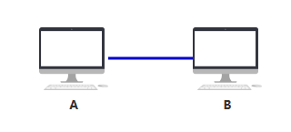
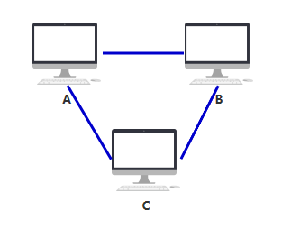
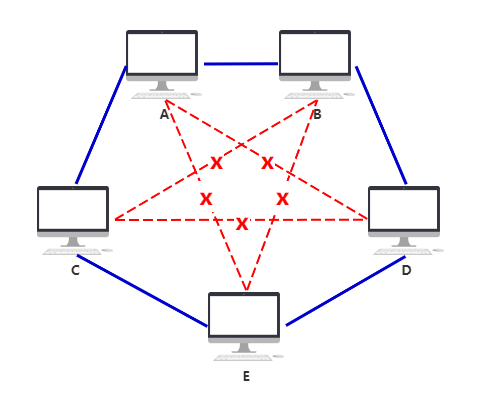
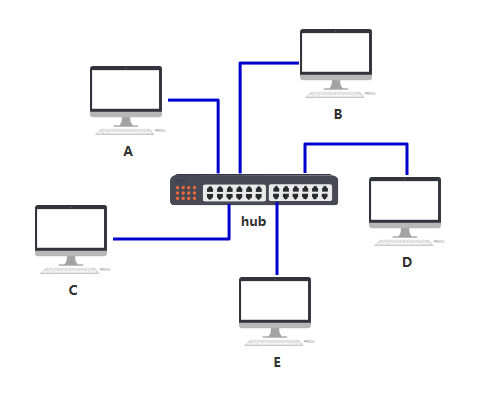
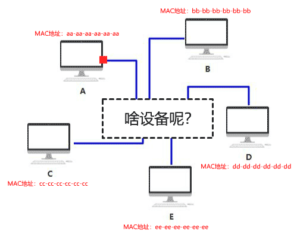
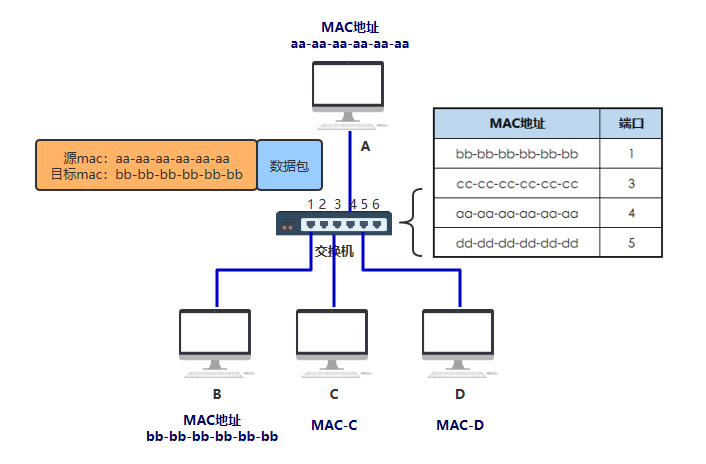
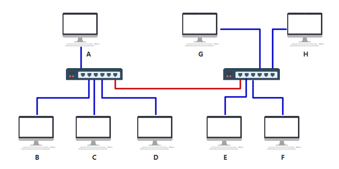
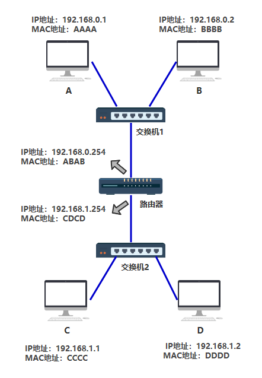
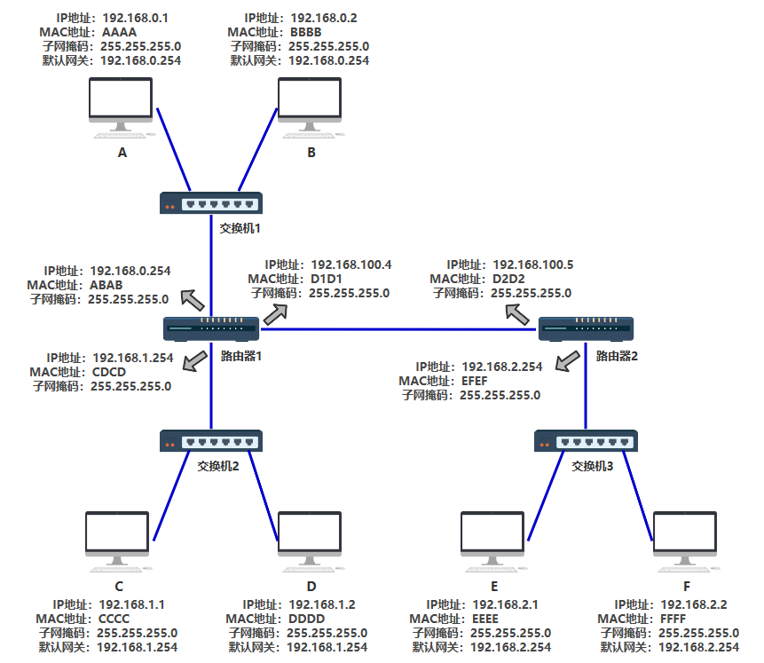

# 如果让你设计网络

在很久很久以前,是一个单机的时代,你不予任何其他电脑相连，孤苦伶仃。

直到有一天，你希望与另一台电脑 B 建立通信，于是你们各开了一个网口，用一根网线连接了起来。

如果你纠结，要么去研究一下操作系统是如何处理网络 IO 的，要么去研究一下包是如何被网卡转换成电信号发送出去的

通过一条电线发送信息: 我们把电线中的0v和5v当做是两种不同的状态，0v代表数字0,5v代表数字1,我们就可以用电线来传递数字了? 但是我们如何传递文字呢？英文？中文？ (请参考编码一书)

我们来先找个线，并连接示波器

x轴为时间间隔,这里的单位是100纳秒

y轴为电压,500mv一格，所以电压是在1v和-1v之间来回

图中代表着每一个0和1传递的波形(在100M/bps下)

看它的话就是看在100ns的结束点是从低电压 ---> 高电压 还是 高电压 ----> 低电压

那么0和1如何变成网络中的帧呢？

数据像流水一样不断的传递 0 和 1 ,虽然可以得到数据，但是我们怎么才能分辨哪些数据是整体

我们需要确定数据的边界

以太网帧刚开始的时候会经历一个96bit传输的静默期(保持0电压),表示我还没有开始

然后传递56个0和1交替组成，是以太网帧的7字节同步码

然后是以太网开始帧的定界符 10101011

接下来就可以读取数据了，每8位读取一字节的数据

最后还有个帧的校验（记录帧的大小，防止帧大小变化）

有一天，一个新的小伙伴C加入了,但聪明的你们很快就会发现，可以每个人开两个网口，用一共三根网线，彼此相连

随着越来越多的人加入，你发现身上开的网口实在太多了，而且网线密密麻麻，混乱不堪。（而实际上一台电脑根本开不了这么多网口，所以这种连线只在理论上可行，所以连不上的我就用红色虚线表示了，就是这么严谨哈哈~）

于是你们发明了一个中间设备，你们将网线都插到这个设备上，由这个设备做转发，就可以彼此之间通信了，本质上和原来一样，只不过网口的数量和网线的数量减少了，不再那么混乱。

你给它取名叫集线器，它仅仅是无脑将电信号转发到所有出口（广播），不做任何处理，你觉得它是没有智商的，因此把人家定性在了物理层（一层设备）。

由于转发到了所有的出口, 那么BCDE四台机器怎么知道数据是不是发给自己的？

首先，你要给所有的连接到集线器的设备，都起个名字。原来你们叫 ABCD，但现在需要一个更专业的，全局唯一的名字作为标识，你把这个更高端的名字称为 MAC 地址。

你的 MAC 地址是 aa-aa-aa-aa-aa-aa，你的伙伴 b 的 MAC 地址是 bb-bb-bb-bb-bb-bb，以此类推，不重复就好。

这样，A 在发送数据包给 B 时，只要在头部拼接一个这样结构的数据，就可以了。

B在收到数据包后，根据头部的目标MAC地址信息，判断是否是自己的

其他的CDE收到数据包后，根据头部的目标MAC地址信息，判断这个数据包并不是发送给自己的，于是便丢弃了.

虽然集线器使整个布局干净不少，但原来我只要发给电脑 B 的消息，现在却要发给连接到集线器中的所有电脑，这样既不安全，又不节省网络资源。

如果把这个集线器弄得更智能一些，只发给目标 MAC 地址指向的那台电脑，就好了。

虽然只比集线器多了这一点点区别，但看起来似乎有智能了，你把这东西叫做交换机。也正因为这一点点智能，你把它放在了另一个层级，数据链路层（二层设备）。

> 这里，其实可以理解为交换机真的拥有了一定的能力来判断应该从什么地方发送到什么地方

交换机内部维护一张 MAC 地址表，记录着每一个 MAC 地址的设备，连接在其哪一个端口上。

交换机的工作原理:交换机属于二层设备,***可以识别以太网帧中的MAC地址信息***,根据MAC地址转发,并把MAC地址与对应的端口记录在自己内部的地址表中

- 当交换机从某个端口收到一个数据包，它先读取包头中的源MAC地址，这样它就知道源MAC地址的机器是连在哪个端口上的
- 再去读取包头中的目的MAC地址，并在地址表中查找相应的端口
如表中有与这目的MAC地址对应的端口，把数据包直接发送到这端口上
- 如表中找不到相应的端口则把数据包广播到所有端口上(这个叫洪泛,盲目转发)，当目的机器对源机器回应时，交换机又可以学习一目的MAC地址与哪个端口对应，在下次传送数据时就不再需要对所有端口进行广播了
- 不断的循环这个过程，对于全网的MAC地址信息都可以学习到，二层交换机就是这样建立和维护它自己的地址表
> 交换机一般都有跟路由器的接口，如果找不到局域网内的MAC地址，就直接转发给路由器了,由路由器来解IP包

经过该网络中的机器不断地通信，交换机最终将 MAC 地址表建立完毕~

随着机器数量越多，交换机的端口也不够了，但聪明的你发现，只要将多个交换机连接起来，这个问题就轻而易举搞定~

你完全不需要设计额外的东西，只需要按照之前的设计和规矩来，按照上述的接线方式即可完成所有电脑的互联，所以交换机设计的这种规则，真的很巧妙。你想想看为什么（比如 A 要发数据给 F）。

但是你要注意，上面那根红色的线，最终在 MAC 地址表中可不是一条记录呀，而是要把 EFGH 这四台机器与该端口（端口6）的映射全部记录在表中。

最终，两个交换机将分别记录 A ~ H 所有机器的映射记录。

左边的交换机

MAC 地址	端口
bb-bb-bb-bb-bb-bb	1
cc-cc-cc-cc-cc-cc	3
aa-aa-aa-aa-aa-aa	4
dd-dd-dd-dd-dd-dd	5
ee-ee-ee-ee-ee-ee   6
ff-ff-ff-ff-ff-ff   6
gg-gg-gg-gg-gg-gg   6
hh-hh-hh-hh-hh-hh   6

右边的交换机

bb-bb-bb-bb-bb-bb	1
cc-cc-cc-cc-cc-cc	1
aa-aa-aa-aa-aa-aa	1
dd-dd-dd-dd-dd-dd	1
ee-ee-ee-ee-ee-ee   2
ff-ff-ff-ff-ff-ff   3
gg-gg-gg-gg-gg-gg   4
hh-hh-hh-hh-hh-hh   6

这在只有 8 台电脑的时候还好，甚至在只有几百台电脑的时候，都还好，所以这种交换机的设计方式，已经足足支撑一阵子了。

但很遗憾，人是贪婪的动物，很快，电脑的数量就发展到几千、几万、几十万。

交换机已经无法记录如此庞大的映射关系了。

> 交换机也会存在环路的情况,这时候也要处理下环路的情况

此时你动了歪脑筋，你发现了问题的根本在于，连出去的那根红色的网线，后面不知道有多少个设备不断地连接进来，从而使得地址表越来越大。

那我可不可以让那根红色的网线，接入一个新的设备，这个设备就跟电脑一样有自己独立的 MAC 地址，而且同时还能帮我把数据包做一次转发呢？

这个设备就是路由器，它的功能就是，作为一台独立的拥有 MAC 地址的设备，并且可以帮我把数据包做一次转发，你把它定在了网络层（四层）。

我们引入了一个新的地址---IP地址,IP地址的作用一个是我们需要IP地址承载更多的连接数量（IP地址这个概念就是因为加入了路由器才体现出来的,所以,路由器是四层设备）

下面我们就举例两种情况： A --> B 以及A ---> 路由器

同网段的情况:

- 首先检查自己的ARP缓存表,有没有缓存目标IP地址的MAC地址,如果有,直接发送,不再进行下一步;
- A先发送ARP协议,询问所有的网络中的主机，谁的IP地址是目标B主机IP地址(目标MAC ff::ff::ff交换机转发,交换机记录A MAC-1端口)，所有主机收到ARP
- 目标B的主机回应ARP响应，告诉A我是目标IP地址，并给到自己的MAC地址,通过交换机回复A主机(交换机记录B MAC-2端口),并将A的MAC地址存入自己的ARP缓存表中(B记录A IP-MAC)
- 这一次，A的ARP缓存表缓存了B主机的MAC地址,(A记录B IP-MAC )然后再次发送数据,这次就可以直接交付给B主机了..见步骤1

> 概念: arp请求 arp缓存表  mac地址表 

不同的网段情况（忽略交换机mac地址表）：

- 首先检查自己的ARP缓存表,有没有缓存路由器的MAC地址,如果有,直接发送,不再进行下一步...
- 我们事先已经在电脑中设置了我们的网关 -- 也就是我们的路由器的IP地址
- A先发送ARP协议，询问所有的网络中的主机，谁的IP地址是网关(目标MAC ff::ff::ff交换机转发,交换机记录A MAC-1端口) ARP协议中目标IP地址是网关
- 路由器收到后,记录A的IP地址对应的MAC地址到自己的ARP高速缓存表中(路由器记录A IP-MAC-端口0)
- 路由器响应ARP,告诉A，我是目标IP地址，并给到自己端口的MAC地址,通过交换机发给A(交换机记录 路由器 MAC-2端口)
- 到达A后A的ARP缓存表缓存了路由器的MAC地址(A记录路由器 IP-MAC),然后再发送数据,这次可以直接发送给路由器了..见步骤1

> 概念: 网关

交换机中有 MAC 地址表用于映射 MAC 地址和它的端口

路由器中有路由表用于映射 IP 地址(段)和它的端口

电脑和路由器中都有 arp 缓存表用于缓存 IP 和 MAC 地址的映射关系

路由器拿到之后，会根据路由表不断的变化MAC地址将数据传递出去

- 路由器通电后，会记录每个网段对应的端口
- 数据包从路由器的某一个端口进来,路由器解包根据目标IP地址的网段查看该路由器的路由表,判断应该从哪个端口进行转发或者下一跳的IP地址,找不到的话就直接丢弃了或者走默认路由....

第一种情况：路由器--交换机（通常考虑直连的网段，目标IP跟路由器直连）

- 路由器每个端口对应着不同的网段,路由器开机的时候会自动记录每个端口对应的网段(因为是直连)
- 数据包达到路由器端口后,因为目标IP与路由器的某个端口直接相连,路由表中记录(目标网络 下一跳 接口),所以,路由器直接将该数据包转发到对应网段的端口上
- 路由器查找ARP缓存表，看下有没有目标IP地址的MAC地址，有直接交换机转发，不在进行下一步
- 目标IP的MAC地址没有在ARP缓存表中的话,丢弃该帧
- 路由器发ARP请求,通过交换机(ff::ff::ff广播)广播给所有的主机(交换机记录 路由器MAC-1端口)
- 目标IP地址的主机B收到后,首先缓存路由器IP地址和MAC地址(B记录路由器 IP-MAC)，然后通过交换机(交换机记录 B-2端口)转发给路由器
- 路由器缓存了目标IP地址的MAC地址(路由器记录B IP-MAC-端口)
下次数据再来的时候,从步骤三直接发送给目标主机B

第二种情况: 路由器--路由器 (通常考虑是非直连的网段,目标IP跟路由器并不直接相连)

- 数据包到达路由器端口后,因为目标IP的网段与路由器直连的网段都不相同,所以路由器根据路由表决定下一跳
- 根据路由表信息,路由器将对应的数据包转发到对应的端口上
- 数据包达到路由器端口后，路由器检查自己的ARP缓存表,看下有没有下一跳的MAC地址,有的话直接发送出去
- 如果找不到目标IP地址对应的MAC地址直接丢弃该帧
- 路由器发送ARP请求,得到下一跳的IP地址(路由器)的MAC地址,并缓存起来 (路由器1记录 路由器2 IP-MAC-端口)
- 下次数据再来的时候,从步骤三直接发送给下一个路由

